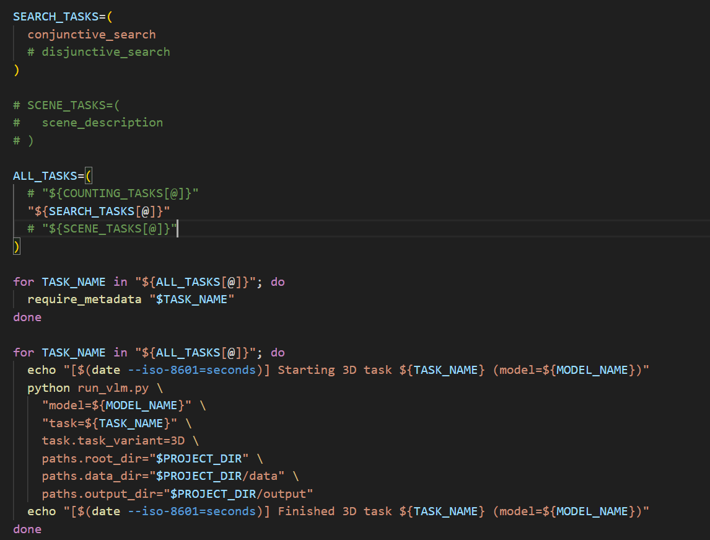

# Binding Open VLM

This repository contains task definitions, prompts, and utilities for evaluating visual-language models (VLMs) on binding-oriented benchmarks such as counting, search, scene description, and Raven-style matrix tasks. Everything is configured via Hydra to make it easy to swap models, tasks, and execution environments (workstation vs. HPC).

## Running Any Task Locally

1. Create virtual environment and activate it
2. Install the necessary dependency
3. Launch a task with Hydra overrides, pointing the paths to your storage locations:

```bash
python run_vlm.py \
  model=<model_config_name> \
  task=<task_config_name> \
  paths.root_dir=/absolute/path/to/binding-open-vlm \
  paths.data_dir=/absolute/path/to/binding-open-vlm/data \
  paths.output_dir=/absolute/path/to/binding-open-vlm/output
```

Replace `<model_config_name>` (e.g., `qwen3_vl_30b`) and `<task_config_name>` (e.g., `counting_distinct`) with any of the configs under `config/model` and `config/task`. Hydra lets you tack on further overrides (e.g., `task.n_trials=5`) when you need to tweak a run without editing the YAML files.

## Running the Jobs via SLURM on HPC

To run a long lasting job with GPU on hpc you need to submit the task as sbatch job using the `sbatch`command. 

E.g. to schedule the provided SLURM batch job that runs the Qwen3-VL model against the configured task, submit `qwen3_vl_job.sbatch`:

```bash
sbatch ./qwen3_vl_job.sbatch
```

Adjust the SBATCH directives inside the script if you need different queues, GPUs, or walltime, and edit the Hydra overrides at the bottom to target a different task/model combination before submitting.

## Running a Task for Other Models

Follow the same pattern as the Qwen3-VL setup whenever you want to exercise a different local VLM.

1. **Download or cache the weights**  
   Point `weights_path` to a directory under `model-weights/`. If it is empty, fetch the checkpoint from Hugging Face (or your artifact store) before launching Hydra, for example:

   ```bash
   huggingface-cli download <org>/<model-id> \
     --local-dir ${PROJECT_ROOT}/model-weights/<ModelFolder> \
     --local-dir-use-symlinks False
   ```

   You can also adapt `examples/test_qwen3_vl.py`, which calls `huggingface_hub.snapshot_download`, to programmatically pull the files the first time they are needed.

2. **Define the Hydra model config**  
   Create `config/model/<your_model>.yaml` that inherits from `base_vlm_local`, sets `_target_` to your Python class, and points `weights_path` at the folder you prepared:

   ```yaml
   defaults:
     - base_vlm_local
   _target_: models.my_model.MyModel
   model_name: my-awesome-vlm
   weights_path: '${paths.root_dir}/model-weights/MyModel'
   batch_size: 8
   prompt_format: null
   ```

3. **Implement the model class**  
   Add `models/my_model.py` with a class that extends `LocalVLModel`. Initialize whatever processor/model objects you need in `__init__` (similar to `models/qwen_model.QwenModel`), then implement `run_batch(self, batch)` to load the batch’s image paths, form prompts, call your backend, and return the batch with a filled `response` column.

4. **Run tests or full tasks**  
   Invoke the exact Hydra job used for Qwen, swapping the model override:

   ```bash
   python run_vlm.py \
     model=<your_model> \
     task=<task_config_name> \
     paths.root_dir=/absolute/path/to/binding-open-vlm \
     paths.data_dir=/absolute/path/to/binding-open-vlm/data \
     paths.output_dir=/absolute/path/to/binding-open-vlm/output
   ```

   For HPC runs, duplicate or edit `qwen3_vl_job.sbatch` so it references `model=<your_model>` (and any other overrides) before submitting with `sbatch`. This gives you the same reproducible pipeline, only backed by your new VLM class.

## Aggregating 2D Task Results

Once you run all the tasks for a specific model you should have results that looks like as follows:

```
./output/
└── vlm
    └── 2D
        ├── conjunctive_search
        │   └── <model-name>.csv
        ├── counting_control
        │   └── <model-name>.csv
        ├── counting_control_shape
        │   └── <model-name>.csv
        ├── counting_distinct
        │   └── <model-name>.csv
        ├── counting_high_diversity
        │   └── <model-name>.csv
        ├── counting_low_diversity
        │   └── <model-name>.csv
        ├── disjunctive_search
        │   └── <model-name>.csv
        ├── disjunctive_search_control
        │   └── <model-name>.csv
        ├── rmts
        │   ├── decomposed
        │   │   ├── features
        │   │   │   └── <model-name>.csv
        │   │   ├── features2
        │   │   │   └── <model-name>.csv
        │   │   ├── full
        │   │   │   └── <model-name>.csv
        │   │   └── relations
        │   │       └── <model-name>.csv
        │   └── unified
        │       ├── features
        │       │   └── <model-name>.csv
        │       ├── features2
        │       │   └── <model-name>.csv
        │       ├── full
        │       │   └── <model-name>.csv
        │       └── relations
        │           └── <model-name>.csv
        ├── scene_description
        │   └── <model-name>.csv
        └── scene_description_balanced
            └── <model-name>.csv
```

After this use `aggregate_vlm_2d.py` to summarize and aggregate the task outputs so that you end up with per-family summaries in `analysis/results/2D/`:

```
analysis/results/2D/
├── <model-name>_counting.csv
├── <model-name>_rmts.csv
├── <model-name>_scene_description.csv
└── <model-name>_visual_search.csv
```

Use the command below (override paths if your directories differ):

```bash
python aggregate_vlm_2d.py \
  --model-name <model-name> \
  --results-root ./output/vlm/2D \
  --out-dir ./analysis/results/2D
```

## Monitoring and Managing SLURM Jobs

- Check a specific job’s live status:

  ```bash
  squeue -j <job-id>
  ```

- List all of your queued/running jobs:

  ```bash
  squeue -u <username>
  ```

- Cancel a job you no longer need:

  ```bash
  scancel <job-id>
  ```

Refer to the HPC documentation for more details on job control and best practices: https://docs.hpc.ut.ee/public/cluster/Running_jobs/submit_jobs/

## Troubleshooting LMDeploy + Qwen3-VL

If you see the following LMDeploy error while loading Qwen3-VL:

```
lmdeploy - ERROR - base.py:55 - AttributeError: 'Qwen3VLConfig' object has no attribute 'hidden_size'
2025-11-03 21:40:56,729 - lmdeploy - ERROR - base.py:56 - check failed!
("Checking failed with error 'Qwen3VLConfig' object has no attribute 'hidden_size'", 'Please send issue to LMDeploy with error logs.')
```

Install LMDeploy with the Turbomind backend disabled, as suggested in https://github.com/InternLM/lmdeploy/issues/4098:

```bash
pip uninstall lmdeploy -y
git clone https://github.com/InternLM/lmdeploy.git
cd lmdeploy
git fetch origin pull/4093/head:qwen3vl
git checkout qwen3vl
DISABLE_TURBOMIND=1 pip install -e .
```

Re-run your job after reinstalling; the patched build exposes the `hidden_size` attribute expected by the loader.

## Generating 3D dataset

The 3D workflow is two-step: (1) generate the datasets with `generate_3d_vlm_datasets.sh` (submit via `generate-dataset.sbatch` on Slurm), then (2) run the VLM experiments with `experiments_job_3d.sbatch` once the datasets are present.

Before running experiments, generate the 3D datasets and metadata.

3D dataset generation requires a Blender binary to render scenes from the `.blend` file into `.png` images.

If you are running locally, install Blender and set the path to the binary (e.g. in `generate-dataset.sbatch`):

```bash
export BLENDER_BIN="/path/to/blender-binary/blender"
test -x "$BLENDER_BIN" || { echo "ERROR: BLENDER_BIN not executable: $BLENDER_BIN"; exit 1; }
```

If you are running on an HPC cluster via Slurm, you can download a Blender binary to any folder and point `BLENDER_BIN` at it:

```bash
# download the latest blender
wget https://ftp.nluug.nl/pub/graphics/blender/release/Blender5.0/blender-5.0.1-linux-x64.tar.xz

# unzip using tar
tar -xvf blender-5.0.1-linux-x64.tar.xz

# if tar command does exist, try this 
module load tar
# then unzip the blender xz file.
```

Then update `generate-dataset.sbatch` to point to the extracted binary, e.g.:

```bash
export BLENDER_BIN="$HOME/binary/blender-5.0.1-linux-x64/blender"
test -x "$BLENDER_BIN" || { echo "ERROR: BLENDER_BIN not executable: $BLENDER_BIN"; exit 1; }
```

Generate the 3D dataset with Blender (writes to `data/vlm/3D/...` by default).

```bash
# Run all tasks (default)
BLENDER_BIN=blender bash ./generate_3d_vlm_datasets.sh

# Run a single task
BLENDER_BIN=blender bash ./generate_3d_vlm_datasets.sh --task conjunctive_search
BLENDER_BIN=blender bash ./generate_3d_vlm_datasets.sh --task disjunctive_search
BLENDER_BIN=blender bash ./generate_3d_vlm_datasets.sh --task counting_low_diversity
BLENDER_BIN=blender bash ./generate_3d_vlm_datasets.sh --task counting_high_diversity
BLENDER_BIN=blender bash ./generate_3d_vlm_datasets.sh --task counting_distinct
BLENDER_BIN=blender bash ./generate_3d_vlm_datasets.sh --task scene_description

# Show help / list tasks
bash ./generate_3d_vlm_datasets.sh --help
```

Metadata is generated automatically after each task finishes:

```bash
ls ./data/vlm/3D/conjunctive_search/metadata.csv
```

### Running on SLURM (separate jobs per task)

In your `sbatch` i.e `generate-dataset.sbatch` script, call the generator with `--task` so each job only produces one dataset and its `metadata.csv`:

```bash
# Example to run disjuncitvive_search edit sbatch script's last line as follows
bash "$PROJECT_DIR/generate_3d_vlm_datasets.sh" --task disjunctive_search
```

Run tasks for 3D dataset
```bash
python run_vlm.py task=conjunctive_search task.task_variant=3D paths.root_dir="$(pwd)" paths.data_dir="$(pwd)/data" paths.output_dir="$(pwd)/output"
```
Or using the slurm job 
```bash
sbatch experiments_job_3d.sbatch
```
Inisde experiments_job_3d.sbatch you can enable specific task at a time so that you can submit multiple jobs using `sbatch experiments_job_3d.sbatch`. 
E.g The following snippets only runs `conjunctive_search` when you submit the job. 


Or this can be automated in a way that submits separate job for each task. (TODO)
### Aggregating 3D results

After running the 3D tasks, aggregate results for one model from `output/vlm/3D` into `analysis/results/3D`:

```bash
# specify the exact CSV filename (model name) that that you wnat to aggregate for
python aggregate_vlm_3d.py --model-name qwen3-vl-30b-a3b-instruct
```
